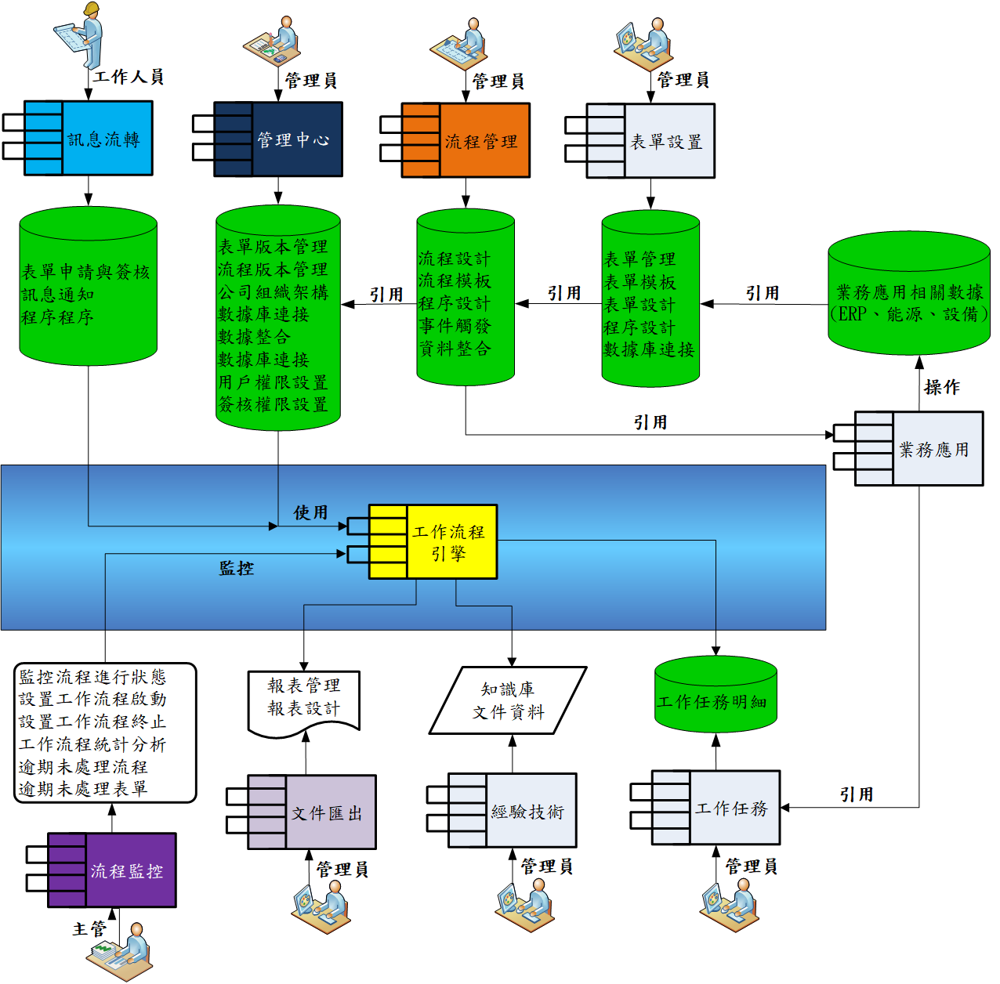

# FastBPM 企業流程管理的可視化工具

FastBPM是企業工作流程管理系統，解決企業流程管理遇到的問題，並以企業整體運作、自上而下、結構化、體系化的流程設計。透過e化過程，整合人力資源、訊息傳遞、管理流程、經營數據與技術知識。

> **加入 Facebook 社團**
>
> [https://www.facebook.com/groups/isoface/](https://www.facebook.com/groups/isoface/)
> 
> **點讚追蹤 Facebook 粉絲專頁**
> 
> [https://www.facebook.com/AIOT.ERP](https://www.facebook.com/AIOT.ERP)

## **工廠工作管理經常發生以下問題：**

1. 僅有少數資深員工知道工作該如何處理(資訊掌握在少數人、複製性、可重複使用性低) 。
2. 無法有效培養接續作業人員(培訓時間較長、效率較低) 。
3. 仍有大量資訊種類尚待書面電子化。
4. 整體流程性之考量偏低。
5. 訊息無法及時性取得(資訊收集依靠資深人員記在個人腦海裡)。
6. 缺乏多面向業務資訊，無法正確判斷管理決策。

企業工作流程管理系統，可用於解決上述問題，並以企業整體運作、自上而下、結構化、體系化的流程設計。透過e化過程，整合人力資源、訊息傳遞、管理流程、經營數據與技術知識。

## **企業工作流程管理系統的實現目標如下︰**

1. 公司管理流程與客戶需求整合，改造員工的分工與共識，提升各部門績效與客戶滿意度。
2. 制定標準作業流程、作業事項、要求重點、作業表單、與統計分析內容。
3. 工作流程需求整合，包括生產作業表單、品管作業表單，每個流程都有相關配套文檔與注意事項。
4. 工作流程匯出作業，依據客戶需求自動生成文件。
5. 工作流程銜接跨部門知識點、提高人力產出品質。
6. 防止可能的弊端，強化稽核，隨時預警工作是否完成。
7. 資料庫彙整管理，達成數據化，做到賞罰公平的公司文化。
8. 跨系統資料整合，並將技術平台與電腦作業人員整合，達到e化管控。

規劃企業流程管理系統管理架構，將現有工作分解，按照固定的規則和過程來執行並監控，提高效率，降低成本。完成經營整合與經營程序自動化，建立由工作流程管理系統執行的業務模型。並追蹤每項工作參與者的工作進度，讓員工瞭解整個團隊應如何互相配合，快速完成工作目標，進而開始思考「該怎麼做才能做得更好」。無論是：財務管理、人事管理、業務管理、品質管理、行政管理、生產管理....，都可以朝向全面數位化流程管理，將智慧流程與數據整合，提供企業更高的工作效率，達到節省成本等效益。

## **系統架構**

企業流程管理系統運行，是工作流程的核心，在工作流程的服務週期中，它銜接各項工作流的配套服務，如工作流實例狀態跟蹤、記錄軌跡、消息分發等。系統架構如下圖︰

## 工作原理

企業流程管理系統運行在工作流程引擎之上，用於定義、實現和管理工作流程運行的軟體。它與工作流執行者(人、應用)交互，推進工作流實例的執行，並監控工作流的運行狀態，運行原理如下︰

## 功能結構

在工作流程的基礎上，使用者需要對工作流程進行配置形成業務流程定義。業務流程定義也可以稱為業務流程範本，它包含了業務流程模型以及對流程模型配置的所有資訊，它的作用是告訴業務流程引擎如何創建流程實例和如何執行業務流程。流程配置的功能如下：

1. 設定流程的版本資訊，標識出同一業務流程的不同版本。
2. 設定流程環節的執行許可權。
3. 設定流程環節間，傳遞的資訊類型。
4. 設定控制流程節點間流轉的調度規則。
5. 設定流程節點的執行方式，包括自動和人工兩種流程環節。
6. 設定自動流程環節需要調用的外部功能/程式(例如自動生成品質管理文件、各式SPC圖表..)。
7. 支援流程的審批與發佈功能。
8. 設置每個流程節點，採用的知識庫。
9. 設置每個流程節點，連接的企業經營管理表單。

## 系統框架

企業流程管理系統採用Web的工作流管理與監控工具，是企業管理者及時掌握業務運行狀況，並對客戶與市場進行快速回應的利器。通過對工作流實行圖形化的即時監控，管理者可以及時掌握業務處理的最新動態；及時發現長時間滯留未處理的任務；對發生異常的工作流進行及時調整。軟體系統採用三層式應用伺服器架構，Web頁面請求通過控制器統一處理，根據請求類型分發到各個業務處理類。系統分層邏輯模型圖如下︰

